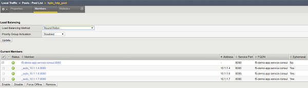
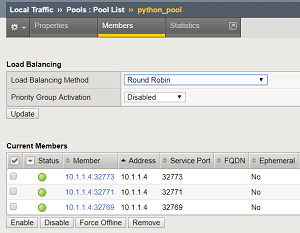
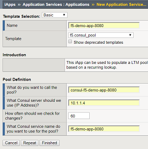

F5 Demo - Consul.io
===================


Introduction
------------

Examples of using Consul by HashiCorp with F5-BIG-IP

Prerequisites
------------

* FQDN Pools (>= TMOS 12.1.3)
* F5 Python SDK (Python Examples)
* iControlLX (>= TMOS 13.1)

Examples
--------

 1. Using FQDN Pool
 1. Use an External Python script
 1. Use an iControlLX Worker

1. Using FQDN Pool
------------------

Configure BIG-IP to use Consul's [DNS Interface](https://www.consul.io/docs/agent/dns.html):

This works if all your services are using the same port.



2. Using an External Python script
----------------------------------

The F5 Python SDK can be used with the Consul API to query for pool members.  This is useful in cases where you are using a dynamic range of pool member ports (i.e. with Registrator).

```
% python update.py --bigip-host 10.1.1.5 --consul-service f5-demo-app-8080 --pool-name python_pool
```



Code Snippet

```
...
c = consul.Consul(host=args.consul_host, port=args.consul_port)
nodes = c.catalog.service(args.consul_service)
pool_members = [{"name":"%s:%s" %(a['Address'],a['ServicePort']),"partition":args.partition} for a in nodes[1]]

mgmt = ManagementRoot(args.bigip_host, args.username, args.password, token='tmos')
pool = mgmt.tm.ltm.pools.pool.load(partition=args.partition, name=args.pool_name)
session = mgmt._meta_data['bigip']._meta_data['icr_session']

members = session.put(pool._meta_data['uri'],data=json.dumps({'members':pool_members}))
...
```

3. Using iControlLX Worker
----------------------------

Starting in TMOS 13.1 you can extend the BIG-IP Management plane functions with Node.JS.  The following is an example of using a traditional TCL iApp to onboard an iControlLX worker (RPM file) and create a Node.JS process that queries the Consul API.  This emulates of some of the same ideas used by the [F5 Service Discovery iApp](https://github.com/F5Networks/f5-cloud-iapps/tree/master/f5-service-discovery)

It involves 3 parts.

 1. TCL iApp
 1. TCL iCall script
 1. Node.JS iControlLX

The iApp is used to install the iControlLX code and configure the iCall script to run periodically.

The iControlLX code is used to query Consul and the iCall script updates the pool members.

**iApp Interface**

iApp prompts for pool name, Consul server IP, and Consul service name.  The Demo Consul iControlLX worker is installed if the BIG-IP does not already have it.




**Code Snippet (TCL iCall)**

This code runs at the interval of every 60 seconds.
```
set members [exec curl ... -d "{\"host\": \"10.1.1.4\",\"service\":\"f5-demo-app-8080\"}" https://localhost/mgmt/shared/demo/consul]

 if { $members eq "" } {
    puts "Service Discovery: No matching members found"
 }
 elseif { $members ne "" } {
    tmsh::modify ltm pool consul-f5-demo-app-8080 members replace-all-with \{ $members \}
  }
}

```

**Code Snippet (Node.JS Demo Consul iControlLX Worker)**
```
...
  var options = {'host':post.host};
  var consul = require('consul')(options);

  consul.catalog.service.nodes(post.service, function(err, result) {
    output = result.map(x => x.Address+':'+x.ServicePort);
    output.sort();
    output = output.join(" ");
  restOperation.setBody(output);
...  
```
### Further Documentation

* iControlREST: https://devcentral.f5.com/wiki/iControlREST.HomePage.ashx
* F5 Python SDK: https://github.com/F5Networks/f5-common-python
* iControlLX: https://devcentral.f5.com/wiki/iControlLX.HomePage.ashx
