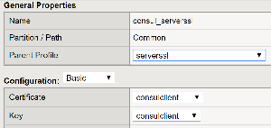
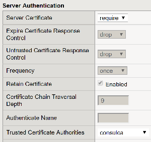
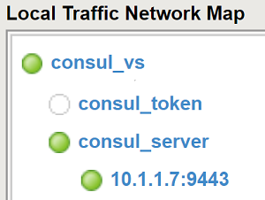

F5 Demo - Consul.io
===================


Introduction
------------

Examples of using Consul by HashiCorp with F5-BIG-IP

Prerequisites
------------

* FQDN Pools (>= TMOS 12.1.3)
* F5 Python SDK (Python Examples)
* iControlLX (>= TMOS 13.1)

Examples
--------

 1. Using FQDN Pool
 1. Use an External Python script
 1. Use an iControlLX Worker

1\. Using FQDN Pool
------------------

Configure BIG-IP to use Consul's [DNS Interface](https://www.consul.io/docs/agent/dns.html):

This works if all nodes for a service are using the same port (all pool members for a specific BIG-IP pool are using the same Service Port).


2\. Using an External Python script
----------------------------------

The F5 Python SDK can be used with the Consul API to query for pool members.  This is useful in cases where you are using a dynamic range of pool member ports (i.e. with Registrator).

```
% python update.py --bigip-host 10.1.1.5 --consul-service f5-demo-app-8080 --pool-name python_pool
```


Code Snippet

```
...
c = consul.Consul(host=args.consul_host, port=args.consul_port)
nodes = c.catalog.service(args.consul_service)
pool_members = [{"name":"%s:%s" %(a['Address'],a['ServicePort']),"partition":args.partition} for a in nodes[1]]

mgmt = ManagementRoot(args.bigip_host, args.username, args.password, token='tmos')
pool = mgmt.tm.ltm.pools.pool.load(partition=args.partition, name=args.pool_name)
session = mgmt._meta_data['bigip']._meta_data['icr_session']

members = session.put(pool._meta_data['uri'],data=json.dumps({'members':pool_members}))
...
```

3\. Using iControlLX Worker
----------------------------

Starting in TMOS 13.1 you can extend the BIG-IP Management plane functions with Node.JS.  The following is an example of using a traditional TCL iApp to onboard an iControlLX worker (RPM file) and create a Node.JS process that queries the Consul API.  This emulates similar methods used by the [F5 Service Discovery iApp](https://github.com/F5Networks/f5-cloud-iapps/tree/master/f5-service-discovery)

It involves 4 parts.

 1. TCL iApp
 1. TCL iCall script
 1. Node.JS iControlLX
 1. Enable TLS auth / Consul token (Optional)

The iApp is used to install the iControlLX code and configure the iCall script to run periodically.

The iControlLX code is used to query Consul and the iCall script updates the pool members.

**iApp Interface**

iApp prompts for pool name, Consul server IP, and Consul service name.  The Demo Consul iControlLX worker is installed if the BIG-IP does not already have it.


**Code Snippet (TCL iCall)**

This code runs at the interval of every 60 seconds.
```
set members [exec curl ... -d "{\"host\": \"10.1.1.4\",\"service\":\"f5-demo-app-8080\"}" https://localhost/mgmt/shared/demo/consul]

 if { $members eq "" } {
    puts "Service Discovery: No matching members found"
 }
 elseif { $members ne "" } {
    tmsh::modify ltm pool consul-f5-demo-app-8080 members replace-all-with \{ $members \}
  }
}

```

**Code Snippet (Node.JS Demo Consul iControlLX Worker)**
```
...
  var options = {'host':post.host};
  var consul = require('consul')(options);

  consul.catalog.service.nodes(post.service, function(err, result) {
    output = result.map(x => x.Address+':'+x.ServicePort);
    output.sort();
    output = output.join(" ");
  restOperation.setBody(output);
...  
```

**Enabling TLS Support**

To enable TLS Client Authentication with Consul we can use a BIG-IP serverssl profile to store the Client SSL cert/key and perform a validation of the Consul server certificate.  

The steps involved:

1. Upload CA cert
1. Upload Client cert/key
1. Create serverssl profile

The outcome should look something like:





You can then configure a Virtual Server that proxies your Consul server.  For example http://255.255.255.254:8500 (BIG-IP)-> https://10.1.1.9:9443 (Consul).  The first address should only be routable from your BIG-IP device.  When configuring your iApp you would use the 255.255.255.254 address instead of the Consul server IP.

**Enabling Consul Token Support (Advanced)**

Consul can be configured with ACLs to require a header that contains "X-Consul-Token".  To avoid storing this token in clear-text in the BIG-IP configuration you could use the following method to keep the token encrypted on the file-system.

The steps involved:

1. Create HTTP monitor with Token as Basic Auth password (will be encrypted)
1. Create iRule that captures Basic Auth password and store in memory
1. Create iRule that fetches the password (Consul Token) and inserts as X-Consul-Token

The resulting configuration will look something like:



A combined version of the iRule (these could be separated)

```
when HTTP_REQUEST {
    # Make sure this is the credentials monitor
    if { [HTTP::uri] == "/credentials" } {
        if { [HTTP::header exists Authorization] } {
            set decoded_secret [findstr [b64decode [findstr [HTTP::header Authorization] "Basic " 6]] "user:" 5]

            # Create/update table entry
            table set consul_secret_key $decoded_secret indefinite
            # Respond so monitor is up
            HTTP::respond 200
        } else {
           HTTP::respond 200
        }
    } else {
    set decoded_secret [table lookup consul_secret_key]
        HTTP::header insert X-Consul-Token $decoded_secret
    }
}

```

This method is similar to what is used by the [F5 Cloud Logger iApp](https://github.com/F5Networks/f5-cloud-iapps/tree/master/f5-cloud-logger)

### Further Documentation

* iControlREST: https://devcentral.f5.com/wiki/iControlREST.HomePage.ashx
* F5 Python SDK: https://github.com/F5Networks/f5-common-python
* iControlLX: https://devcentral.f5.com/wiki/iControlLX.HomePage.ashx
