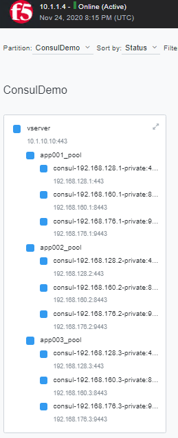

# Consul Service Discovery FAST Template

[FAST template](https://clouddocs.f5.com/products/extensions/f5-appsvcs-templates/latest/) of Consul Service Discovery deployment.

* consul.yaml: Template for deploying Consul Service Discovery

This will create an example of using Consul Service Discovery with AS3.  In this scenario a single virtual server will redirect traffic
to multiple applications that exist in a Consul service registry.  The BIG-IP will use [SNI Routing](https://devcentral.f5.com/s/articles/sni-routing-with-big-ip-31348) to forward requests to the appropriate backend service.

## Requirements

* 1.5.0 >= F5 FAST
* 3.24.0 >= F5 AS3
* BIG-IP LTM


## Building

```
$ zip consul.zip consul.yaml
```
Upload the consul.zip template set.

## Sample Inputs (via API)

```
{
    "tenant": "ChenDemo",
    "services": ["app001","app002","app003"],
    "virtualAddresses": ["10.1.10.10"],
    "uri": "http://10.1.1.8:8500/v1/health/service/",
    "jmesPathQuery": "[*].{id:Node.Node,ip:{private:Node.Node,public:Node.Node},port:Service.Port}",
    "updateInterval": 10,
}
```
## Sample Inputs (via GUI)


## Sample Output

This will create a virtual server that will use a local traffic policy to reference multiple pools.

Example of accessing services via SNI routing.

```
$ curl -k https://app001.example.com --resolve app001.example.com:443:10.1.10.10
Server address: 192.168.128.1:443
Server name: node1
Date: 24/Nov/2020:20:26:44 +0000
URI: /
Request ID: 438145071c4810ac79f310f55e22b07e
SNI: app001.example.com
$ curl -k https://app002.example.com --resolve app002.example.com:443:10.1.10.10
Server address: 192.168.128.2:443
Server name: node1
Date: 24/Nov/2020:20:26:52 +0000
URI: /
Request ID: 2150f17996091d6a08e9ffbbc1912d33
SNI: app002.example.com
```

Each pool will use the Consul Health API to detect the health of each pool member and will extract the IP and Port 
from Consul.



Example of Consul detecting an outage.


Updated Network Map after Service Discovery queries Consul.


